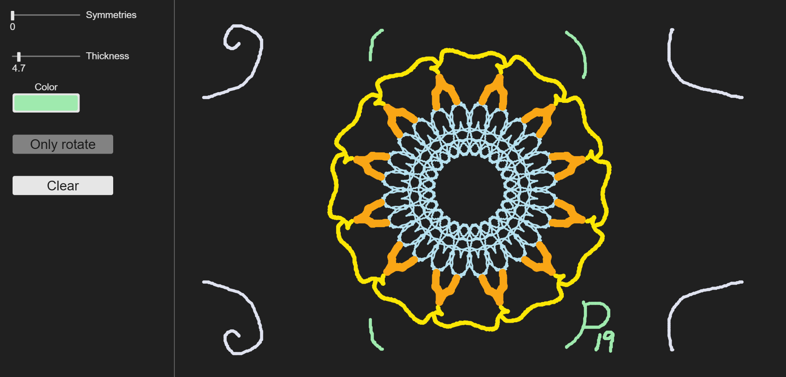

# js-symmetric_drawings
This is a small proyect on symmetry drawing I built using <a href="https://p5js.org/">p5.js</a>.
## URL
This proyect is hosted by github pages, at <a href="https://pabloqb2000.github.io/js-symmetric_drawings/">this link</a>.
## Options
  - Number of symetries
  - Thickness of the brush
  - Color of the brush
  - Clear button
## Note
You can also clear the drawing with the R key.
## Screenshot
</img>
## References
To find more information about the <b>awesome</b> library used for this proyect visit:
<a href="https://p5js.org/"> https://p5js.org/ </a>

## Other proyects
Checkout my other proyects at <a href="https://pabloqb2000.github.io/Math_visualization/">Click math</a>